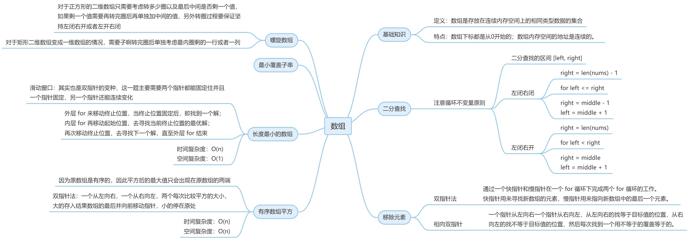

# 数组

### 1. 二分查找
+ 0704
  + 2023.12.7 
  + [代码随想录](https://www.programmercarl.com/0704.%E4%BA%8C%E5%88%86%E6%9F%A5%E6%89%BE.html#%E7%AE%97%E6%B3%95%E5%85%AC%E5%BC%80%E8%AF%BE) 
  + [Leetcode](https://leetcode.cn/problems/binary-search/description/) 
  + [hd2yao](https://github.com/hd2yao/leetcode/tree/master/array/0704.Binary-Search)

### 2. 移除元素
+ 0027
  + 2023.12.8 
  + [代码随想录](https://www.programmercarl.com/0027.%E7%A7%BB%E9%99%A4%E5%85%83%E7%B4%A0.html#%E6%80%9D%E8%B7%AF)
  + [Leetcode](https://leetcode.cn/problems/remove-element/)
  + [hd2yao](https://github.com/hd2yao/leetcode/tree/master/array/0027.Remove-Element)

### 3. 有序数组的平方
+ 0977
  + 2023.12.11
  + [代码随想录](https://www.programmercarl.com/0977.%E6%9C%89%E5%BA%8F%E6%95%B0%E7%BB%84%E7%9A%84%E5%B9%B3%E6%96%B9.html#%E7%AE%97%E6%B3%95%E5%85%AC%E5%BC%80%E8%AF%BE)
  + [Leetcode](https://leetcode.cn/problems/squares-of-a-sorted-array/)
  + [hd2yao](https://github.com/hd2yao/leetcode/tree/master/array/0977.Squares-of-a-Sorted-Array)

### 4. 长度最小的子数组
+ 0209
  + 2023.12.12
  + [代码随想录](https://www.programmercarl.com/0209.%E9%95%BF%E5%BA%A6%E6%9C%80%E5%B0%8F%E7%9A%84%E5%AD%90%E6%95%B0%E7%BB%84.html#%E7%AE%97%E6%B3%95%E5%85%AC%E5%BC%80%E8%AF%BE)
  + [Leetcode](https://leetcode.cn/problems/minimum-size-subarray-sum/)
  + [hd2yao](https://github.com/hd2yao/leetcode/tree/master/array/0209.Minimum-Size-Subarray-Sum)

### 5. 螺旋矩阵II
+ 0059
  + 2023.12.13
  + [代码随想录](https://www.programmercarl.com/0059.%E8%9E%BA%E6%97%8B%E7%9F%A9%E9%98%B5II.html#%E7%AE%97%E6%B3%95%E5%85%AC%E5%BC%80%E8%AF%BE)
  + [Leetcode](https://leetcode.cn/problems/spiral-matrix-ii/)
  + [hd2yao](https://github.com/hd2yao/leetcode/tree/master/array/0059.Spiral-Matrix-II)

### 总结
**思维导图**

