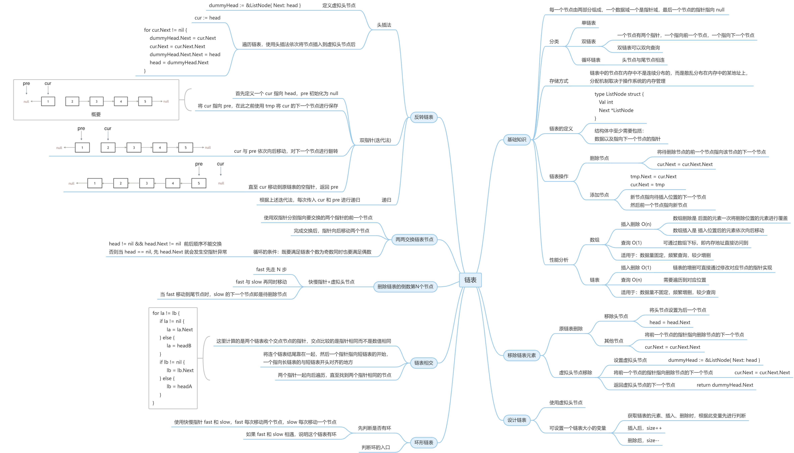

# 链表

### 1. 移除链表元素
+ 0203
    + 2023.12.18
    + [代码随想录](https://www.programmercarl.com/0203.%E7%A7%BB%E9%99%A4%E9%93%BE%E8%A1%A8%E5%85%83%E7%B4%A0.html)
    + [Leetcode](https://leetcode.cn/problems/remove-linked-list-elements/)
    + [hd2yao](https://github.com/hd2yao/leetcode/tree/master/linked-list/0203.Remove-Linked_List-Elements)

### 2. 设计链表
+ 0707
    + 2023.12.20
    + [代码随想录](https://www.programmercarl.com/0707.%E8%AE%BE%E8%AE%A1%E9%93%BE%E8%A1%A8.html)
    + [Leetcode](https://leetcode.cn/problems/design-linked-list/)
    + [hd2yao](https://github.com/hd2yao/leetcode/tree/master/linked-list/0707.Design-Linked-List)

### 3. 反转链表
+ 0206
    + 2023.12.20
    + [代码随想录](https://www.programmercarl.com/0206.%E7%BF%BB%E8%BD%AC%E9%93%BE%E8%A1%A8.html#%E7%AE%97%E6%B3%95%E5%85%AC%E5%BC%80%E8%AF%BE)
    + [Leetcode](https://leetcode.cn/problems/reverse-linked-list/)
    + [hd2yao](https://github.com/hd2yao/leetcode/tree/master/linked-list/0206.Reverse-Linked-List)

### 4. 两两交换链表中的节点
+ 0024
  + 2023.12.21
  + [代码随想录](https://www.programmercarl.com/0024.%E4%B8%A4%E4%B8%A4%E4%BA%A4%E6%8D%A2%E9%93%BE%E8%A1%A8%E4%B8%AD%E7%9A%84%E8%8A%82%E7%82%B9.html#%E7%AE%97%E6%B3%95%E5%85%AC%E5%BC%80%E8%AF%BE)
  + [Leetcode](https://leetcode.cn/problems/swap-nodes-in-pairs/)
  + [hd2yao](https://github.com/hd2yao/leetcode/tree/linked-list/linked-list/0024.Swap-Nodes-in-Pairs)

### 5. 删除链表的倒数第 N 个结点
+ 0019
  + 2023.12.22
  + [代码随想录](https://www.programmercarl.com/0019.%E5%88%A0%E9%99%A4%E9%93%BE%E8%A1%A8%E7%9A%84%E5%80%92%E6%95%B0%E7%AC%ACN%E4%B8%AA%E8%8A%82%E7%82%B9.html#%E7%AE%97%E6%B3%95%E5%85%AC%E5%BC%80%E8%AF%BE)
  + [Leetcode](https://leetcode.cn/problems/remove-nth-node-from-end-of-list/)
  + [hd2yao](https://github.com/hd2yao/leetcode/tree/linked-list/linked-list/0019.Remove-Nth-Node-from-End-of-List)

### 6. 相交链表
+ 0160
  + 2023.12.22
  + [代码随想录](https://www.programmercarl.com/%E9%9D%A2%E8%AF%95%E9%A2%9802.07.%E9%93%BE%E8%A1%A8%E7%9B%B8%E4%BA%A4.html#%E6%80%9D%E8%B7%AF)
  + [Leetcode](https://leetcode.cn/problems/intersection-of-two-linked-lists/)
  + [hd2yao](https://github.com/hd2yao/leetcode/tree/linked-list/linked-list/0160.Intersection-of-Two-Linked-List)

### 7. 环形链表 II
+ 0142
    + 2023.12.25
    + [代码随想录](https://www.programmercarl.com/0142.%E7%8E%AF%E5%BD%A2%E9%93%BE%E8%A1%A8II.html#%E7%AE%97%E6%B3%95%E5%85%AC%E5%BC%80%E8%AF%BE)
    + [Leetcode](https://leetcode.cn/problems/linked-list-cycle-ii/)
    + [hd2yao](https://github.com/hd2yao/leetcode/tree/linked-list/linked-list/0142.Linked-List-Cycle-II)

### 总结
**思维导图**
