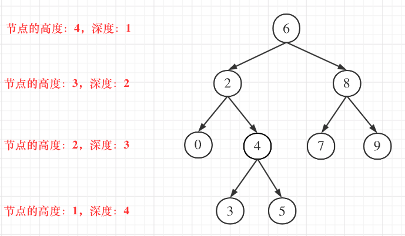

## day29

## 代码随想录算法训练营第二十九天| 二叉树 110 257 404

### 110 平衡二叉树

题目链接：https://leetcode.cn/problems/balanced-binary-tree/

文章讲解：https://programmercarl.com/0110.%E5%B9%B3%E8%A1%A1%E4%BA%8C%E5%8F%89%E6%A0%91.html

视频讲解：https://www.bilibili.com/video/BV1Ug411S7my

#### 思路
在写这道题的时候，先把之前没有仔细学过的二叉树的迭代法以及递归回溯的完成过程学习了一遍，这里记录一下二叉树的高度和深度的概念

- 二叉树节点的高度：指从该节点到叶子节点的最长简单路径边的条数
- 二叉树节点的深度：指从根节点到该节点的最长简单路径边的条数

也即，高度是从下往上数，而深度是从上往下数



因此，求二叉树的深度：

- 前序遍历

    - 先有当前节点的深度
    - 左右子树的深度 + 1
- 层序遍历

  - 层数即深度

二叉树的高度：

- 后序遍历
  
  - 先求左右子树高度
  - 取较大值后 + 1（当前节点）

在这道题中，判断一颗二叉树是否为平衡二叉树，就要判断每一个节点的左右子树的高度差是否小于等于 1 

根据上面的讲解，求高度就需要使用**后序遍历**，同时需要添加一个判断的过程：

- 左右子树的高度差
- 是否已经存在以某一个节点为根节点的二叉树不是平衡二叉树

##### 1. 求左右子树的高度
```go
func getHeight(treeNode *TreeNode) int {
	if treeNode == nil {
		return 0
	}
    
	lh, rh := getHeight(treeNode.Left), getHeight(treeNode.Right)
    
	return max(lh, rh) + 1
}
```

##### 2. 判断
判断左右子树的高度差是否满足要求，不满足则返回 -1
```go
if lh-rh > 1 || rh-lh > 1 {
    return -1
}
```

判断是否已有节点不符合要求
```go
if lh == -1 || rh == -1 {
    return -1
}
```

[完整代码](https://github.com/hd2yao/leetcode/tree/master/training/day29/0110_balanced_binary_tree.go)
