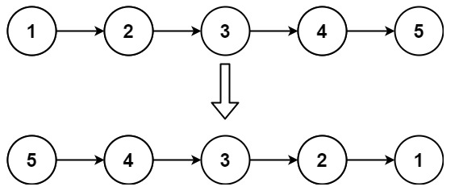
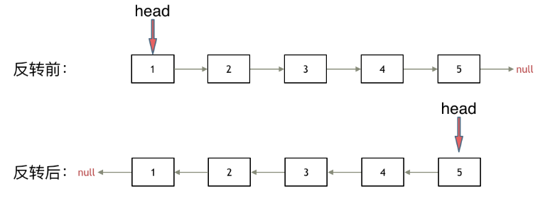
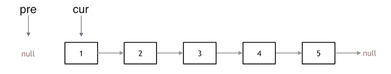
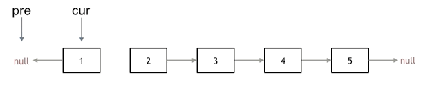
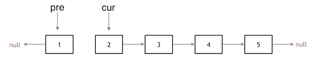
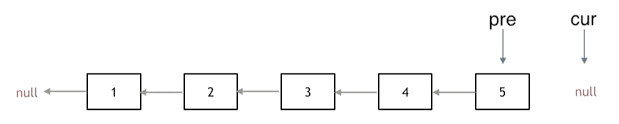

## day3

## 代码随想录算法训练营第三天| 链表 203 707 206

### 203 移除链表元素

题目链接：https://leetcode.cn/problems/remove-linked-list-elements/

文章讲解：https://programmercarl.com/0203.%E7%A7%BB%E9%99%A4%E9%93%BE%E8%A1%A8%E5%85%83%E7%B4%A0.html

视频讲解：https://www.bilibili.com/video/BV18B4y1s7R9

#### 思路
这道题并不难，可以使用临时节点方法，也可以使用虚拟头节点的方法：

- 临时节点需要单独考虑头节点的情况
- 增加虚拟头节点，使得原链表中的头节点 head 也成为了与其他节点相当的节点

#### 临时节点
在这种情况下，链表中的节点可分为：**头节点** 和 **剩余节点**

1. 先考虑 剩余节点

即使不考虑 head.Val == val 的情况，也需要考虑 head == nil 的情况，因此循环条件中需要先判断 `tmp != nil`
```go
tmp := head
for tmp != nil && tmp.Next != nil {
    if tmp.Next.Val == val {
        tmp.Next = tmp.Next.Next
    } else {
        tmp = tmp.Next
    }
}
```
此时，链表中除头节点外已经不在有 val 的节点，接下来考虑头节点的情况
```go
if head != nil && head.Val == val {
    return head.Next
}
```

2. 先考虑 头节点

那么首先要将头部节点值等于 val 的节点都删除
```go
for head != nil && head.Val == val {
    head = head.Next
}
```
然后跟上面方法一样，删除剩余节点中的目标节点

#### 虚拟头节点
使用虚拟头节点的好处就是，无需单独考虑头节点的情况，这里不在赘述

[完整代码](https://github.com/hd2yao/leetcode/tree/master/training/day3/0203_remove_linked_list_elements.go)


### 707 设计链表

题目链接：https://leetcode.cn/problems/design-linked-list/description/

文章讲解：https://programmercarl.com/0707.%E8%AE%BE%E8%AE%A1%E9%93%BE%E8%A1%A8.html

视频讲解：https://www.bilibili.com/video/BV1FU4y1X7WD

[完整代码](https://github.com/hd2yao/leetcode/tree/master/training/day3/707_design_linked_list.go)


### 206 反转链表

题目链接：https://leetcode.cn/problems/reverse-linked-list/

文章讲解：https://programmercarl.com/0206.%E7%BF%BB%E8%BD%AC%E9%93%BE%E8%A1%A8.html

视频讲解：https://www.bilibili.com/video/BV1nB4y1i7eL

#### 思路
这道题我第一次做的时候，也没什么想法，最后使用头插法绕了半天也算是写出来了，现在去看当时的代码，一时间也不好理解

这次做的时候选择了理解起来更容易代码更简便的方法，这应该就是学习算法的意义吧

直接文字描述的话，可能不容易说清楚，下面我结合图例会更加清晰

首先，这张是 leetcode 上的实例图



如果直接根据这张图来思考，我们第一反应应该都会是：新构造一个链表，遍历原链表，然后使用头插法插入新链表

这种方法会造成内存的浪费

因此，我们将上面的图稍微改一下，



看这张图，我们很容易发现反转链表其实就是将节点间的指针反转

调整指针指向会大大减少内存的占用

下面我们来看一下反转的过程：

1. 定义初始指针

我们需要两个指针，分别指向相邻的两个节点，当指针反转后，原本相邻的两个节点变成了两个链表的头节点

> 如果只定义了一个指针，定义的临时指针无论是指向前一个节点还是后一个节点，当指针反转后，临时节点不在，我们便会丢失节点



```go
var prev *ListNode
cur := head
```

2. 反转链表

如图，指针反转后，2号节点会丢失，因此，此处需要一个临时节点来保存 cur 节点的下一个节点

```go
tmp := rear
rear = rear.Next
```

反转完成后，两个指针都向后移动

```go
tmp.Next = prev
prev = tmp
```

3. 反转结束

如图，当 cur 移动到 nil 节点时，pre 指针正好指向反转后的头节点，至此，反转结束

```go
for cur != nil {
    // ...
}
return prev
```

4. 代码优化

通过上面的过程，我们已经比较清晰地理解了整个过程，代码也很简单，从中可以发现，`head` 指针除了开始赋值给 `cur` 以外都没有再用到

所以，我们可以直接使用 `head` 来代替上面过程中的 `cur`

5. 递归法

我们可以根据上面的过程，写出递归的代码

- 递归结束：当 cur 指向 null
- 递归过程：指针反转的过程，其中递归的新变量对应上面双指针都向后移动

[完整代码](https://github.com/hd2yao/leetcode/tree/master/training/day3/0206_reverse_linked_list.go)