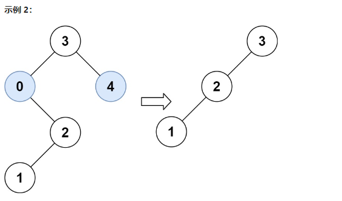

## day36

## 代码随想录算法训练营第三十六天| 二叉树 669 108 538

### 669 修剪二叉搜索树

题目链接：https://leetcode.cn/problems/trim-a-binary-search-tree/

文章讲解：https://programmercarl.com/0669.%E4%BF%AE%E5%89%AA%E4%BA%8C%E5%8F%89%E6%90%9C%E7%B4%A2%E6%A0%91.html

视频讲解：https://www.bilibili.com/video/BV17P41177ud?share_source=copy_web

#### 思路
这道题跟昨天的删除二叉搜索树的节点很像，只不过情况要少一些，因为修剪的话有可能是连带着整颗左或右子树一同删去，这样遍不用考虑左右子树的位置问题

不过这道题需要注意的是，我们要判断节点的值是否在 [low,high] 中，不能仅判断当前节点

如果只考虑当前节点，那么节点 0 不在 [1,3] 内，那么就应该将以 0 为根节点的树删去，但是 0 的右子树又都是满足题意的

因此，这道题我们需要遍历整棵树，不过在这个过程中，我们可以进行剪枝：

首先，我们说下整个过程

- 当前节点在范围内，那么就要分别检查左右子树
- 当前节点不在范围内，

    - 当节点值小于 low，由于是二叉搜索树，当前节点的左子树必然都是小于当前节点值，也就小于 low，因为我们只需要考虑右子树的值
  
        - 这里剪枝左子树
        - 如果右子树为空，可看做是叶子节点，直接返回 nil

    - 当节点值大于 high，由于是二叉搜索树，当前节点的右子树必然都是大于当前节点值，也就大于 high，因为我们只需要考虑左子树的值

        - 这里剪枝右子树
        - 如果左子树为空，可看做是叶子节点，直接返回 nil

因此，递归的终止条件就是找到了要删除的节点，然后按照上面的逻辑剪枝后返回

其实，代码可以优化的，不用判断是否存在左右子树，而是直接加一个终止条件 当节点为空返回 nil，这样的写法可以简化代码

[完整代码](https://github.com/hd2yao/leetcode/tree/master/training/day36/0669_trim_a_binary_search_tree.go)

### 108 将有序数组转换为二叉搜索树

题目链接：https://leetcode.cn/problems/convert-sorted-array-to-binary-search-tree/

文章讲解：https://programmercarl.com/0108.%E5%B0%86%E6%9C%89%E5%BA%8F%E6%95%B0%E7%BB%84%E8%BD%AC%E6%8D%A2%E4%B8%BA%E4%BA%8C%E5%8F%89%E6%90%9C%E7%B4%A2%E6%A0%91.html

视频讲解：https://www.bilibili.com/video/BV1uR4y1X7qL?share_source=copy_web

#### 思路
这道题最关键点就是，使用二分的方式来构造平衡二叉树，也就是每次划分区间都是从数组的中间选取根节点

知道上面的这个思路后，这道题就很好写出来了

[完整代码](https://github.com/hd2yao/leetcode/tree/master/training/day36/0108_convert_sorted_array_to_binary_search_tree.go)
