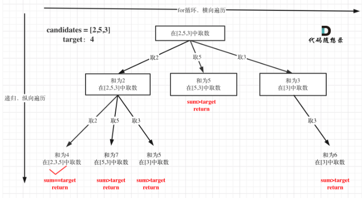

## day38

## 代码随想录算法训练营第三十八天| 回溯法 39 40 131

### 39 组合总和

题目链接：https://leetcode.cn/problems/combination-sum/

文章讲解：https://programmercarl.com/0039.%E7%BB%84%E5%90%88%E6%80%BB%E5%92%8C.html

视频讲解：https://www.bilibili.com/video/BV1KT4y1M7HJ

#### 思路
这道题的关键就是要想清楚如何像昨天的题目一样构造一棵树，并确定每层节点的候选值

因为题目说数组的元素可以重复，我一开始也没有思路，后面我根据下面图中的树完成了代码



- 递归参数和返回值

依旧是 candidates、target、sum

因为选取的值会随着节点取值变化，所以还是需要 startIndex 来控制可选择的数值

- 递归终止条件
```go
if sum == target {
    tmp := make([]int, len(combinationNums))
    copy(tmp, combinationNums)
    result = append(result, tmp)
    return
}
if sum > target {
    return
}
```

- 单层递归逻辑

这里的关键就是确定 startIndex

因为本题数值可以重复，也就是说当前节点选择的值，递归后在下一层节点还是可以选择，因此 `startIndex = i`

也可以像我给出的代码，
```go
backtracking(candidates[i:], sum+candidates[i], target)
```

[完整代码](https://github.com/hd2yao/leetcode/tree/master/training/day37/0077_combinations.go)
