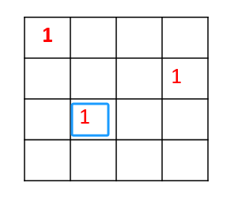

## day44

## 代码随想录算法训练营第四十四天| 回溯法 51 37

### 51 N皇后

题目链接：https://leetcode.cn/problems/n-queens/

文章讲解：https://programmercarl.com/0051.N%E7%9A%87%E5%90%8E.html

视频讲解：https://www.bilibili.com/video/BV1Rd4y1c7Bq/

#### 思路
我先手动模拟了一下使用回溯法构造树的过程

##### 第一步，先构造整体的框架

递归终止

- 寻找到叶子节点为止

单层递归逻辑

- 树的每一层，即一层 for 代表在当前行中寻找合适的皇后的位置
- 直到叶子节点，每一次递归，代表去下一行寻找皇后的位置

递归参数

- for 表示在一行中依次寻找，即列
- 因此，参数需要传入 行row 而不需要 列col

##### 第二步，判断位置是否合法

我是使用两个切片，分别记录某一行某一列是否存在皇后，然后以此来判断是否合法

```go
rowMark := make([]int, n)
colMark := make([]int, n)
```

因为，我们是从上向下一行一行寻找，所以只需要考虑上一行的关系

- 回溯的逻辑决定了，不可能在同一行，无需判断
- 需要判断当前列是否已有皇后
- 判断对角线，因为我们只考虑上一行，而第一行无需考虑与上一行的对角线

    - col = 0，只考虑右上角
    - col != 0 && col != n-1，要考虑左右上角
    - col = n-1，只考虑左上角

代码如下
```go
if colMark[col] == 1 {
	continue
}

if row != 0 && rowMark[row-1] == 1 && 
    (
        (col != 0 && col != n-1 && (colMark[col-1] == 1 || colMark[col+1] == 1)) || 
        (col == 0 && colMark[col+1] == 1) || 
        (col == n-1 && colMark[col-1] == 1)
    ) {
    continue
}
```
但是上面的情况不能保证是在对角线上



如上图的第三行，和第一行不是对角线，但是在判断的第一部分时，`col != 0 && col != n-1 && colMark[col-1] == 1` 是符合的，

即 `rowMark[i] == 1 && colMark[i] == 1` 并不能保证是同一个元素，也可能分别对应两个元素

因此，我们还是需要使用二维数组来去判断

也不能只考虑与上一行的对角关系，


所以还是要沿着左上和右上两条对角线去判断

[完整代码](https://github.com/hd2yao/leetcode/tree/master/training/day44/0051_n_queens.go)

### 37 解数独

题目链接：https://leetcode.cn/problems/sudoku-solver/

文章讲解：https://programmercarl.com/0037.%E8%A7%A3%E6%95%B0%E7%8B%AC.html

视频讲解：https://www.bilibili.com/video/BV1TW4y1471V/

#### 思路

我只能说这道题是真有难度，一层 for 还不够，要两层 for

一层 for 用来填充行，一层 for 用来填充列

更详细的讲解去看文章还有视频吧

[完整代码](https://github.com/hd2yao/leetcode/tree/master/training/day44/0037_sudoku_solver.go)