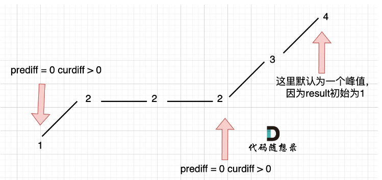

## day45

## 代码随想录算法训练营第四十五天| 贪心法 455 376 53

### 贪心算法

贪心算法的核心就是：**通过局部最优，推出整体最优**

### 455 分发饼干

题目链接：https://leetcode.cn/problems/assign-cookies/

文章讲解：https://programmercarl.com/0455.%E5%88%86%E5%8F%91%E9%A5%BC%E5%B9%B2.html

视频讲解：https://www.bilibili.com/video/BV1MM411b7cq

#### 思路
跟卡哥说的一样，我自己都不知道哪里就用到了贪心算法了

这道题还是比较简单的，一下子就写出来啦

后面去看讲解，大概明白了，贪心法更多的是一种思想，正如代码中后面两种，将这种贪心的思想比较明确的展现了出来

[完整代码](https://github.com/hd2yao/leetcode/tree/master/training/day45/0455_assign_cookies.go)

### 376 摆动序列

题目链接：https://leetcode.cn/problems/wiggle-subsequence/

文章讲解：https://programmercarl.com/0376.%E6%91%86%E5%8A%A8%E5%BA%8F%E5%88%97.html

视频讲解：https://www.bilibili.com/video/BV17M411b7NS

#### 思路
这道题首先先来说峰值的计算，

`prediff < 0 && curdiff > 0 || prediff > 0 && curdiff < 0` 

这是最简单的情况，而当上下坡中有平坡的话，我们先统一规则，选取平坡最右边的数值，那么判断条件就变成了，

`prediff <= 0 && curdiff > 0 || prediff >= 0 && curdiff < 0`，

现在我们来考虑数组头尾的部分，因为上面的条件是涉及到三个数值，

- 头尾分开单独去考虑

这种方式比较容易想到，只要头部元素不同，尾部元素不同，那么就多增加一

- 统一去考虑

如果可以统一考虑，那么数组长度为 2 的数组也可以不用单独考虑了

首先是尾部元素，因为题目中说了，只有两个元素只要不相同，摆动就是 2；那么我们起始计算从 1 开始，这样只需要考虑前面的元素即可，
哪怕是全部相同，最终结果也是 1

然后再来考虑头部元素，针对头部元素我们可以假设前面有一个相同的元素，即 [2,5,...] 对于 2 可以假设为 [2,2,5,...] 

也就是对于 2 的 prediff 为 0，而峰值计算中的判断条件也包含有 prediff = 0 的情况

而在代码中对于如何假设头部元素前有一个相同元素，有这样的一个巧妙方法，
```go
res := 1
prediff := 0
curdiff := 0

for i := 0; i < len(nums)-1; i++ {
    curdiff = nums[i+1] - nums[i]
    if prediff <= 0 && curdiff > 0 || prediff >= 0 && curdiff < 0 {
        res++
    }
    prediff = curdiff
}
```
我们可以看到，先初始化了 prediff 和 curdiff，

进入循环时，我们从头部元素开始，按照上面的说法，假设前面有一个相同的元素，那么 prediff = 0；

而在进入循环时，只先重新计算了 curdiff，prediff 还是 0

真是一个巧妙的思想！

但是上面的代码依然不能完全通过，这是因为还有一种情况，



出现问题是因为，我们的 prediff 一直在更新，

我们应该将 prediff 作为一个记录当前坡度的变量，也就是说只要当遇到峰值时才更新

对于代码，只要将 prediff 的更新放在 if 中即可

[完整代码](https://github.com/hd2yao/leetcode/tree/master/training/day45/0376_wiqqle_subsequence.go)