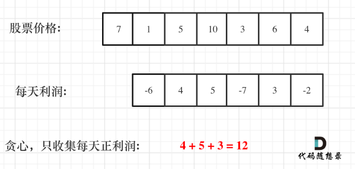

## day46

## 代码随想录算法训练营第四十六天| 贪心法 122 55 45

### 122 买卖股票的最佳时机2

题目链接：https://leetcode.cn/problems/best-time-to-buy-and-sell-stock-ii/

文章讲解：https://programmercarl.com/0122.%E4%B9%B0%E5%8D%96%E8%82%A1%E7%A5%A8%E7%9A%84%E6%9C%80%E4%BD%B3%E6%97%B6%E6%9C%BAII.html

视频讲解：https://www.bilibili.com/video/BV1ev4y1C7na

#### 思路
我先说一下我的思路

首先是局部最优：我们在局部最低点买入，然后再在局部最高点卖出，可以保证在这个区间内的利润最大

然后全部最优：统计全部的局部最优，就能得到全局最优

我画出了数组的折现图，其实思路跟昨天的两道题类似，应该是就综合了 摆动序列 和 最大子数组和

用摆动序列的方法找到极大值和极小值，然后极小值做减法极大值做加法求最大和

想法是正确的，不过在写代码中不好去写出来，

因为可能会像示例中，在第一天买入，第三天卖出，并不是连续两天的买卖，所以直接按照上面的想法写代码是行不通的

##### 利润分解
上面的想法是没错的，但是直接写是不行的，所以我们要将求利润的过程分解

假如第 0 天买入，第 3 天卖出，那么利润为：`prices[3] - prices[0]`

相当于`(prices[3] - prices[2]) + (prices[2] - prices[1]) + (prices[1] - prices[0])`

此时就是把利润分解为每天为单位的维度，而不是从 0 天到第 3 天整体去考虑！

这样我们就能得到每天的利润序列

那么根据贪心算法，我们只要每天是正利润，就能让我们的利润最大

而利润序列，其实就是买卖股票的区间

例如上图 -6，就是第一天买入第二天卖出；像 4 和 5 可以放在一起，就是第二天买入第四天卖出

[完整代码](https://github.com/hd2yao/leetcode/tree/master/training/day46/0122_best_time_to_buy_and_sell_stock_ii.go)
